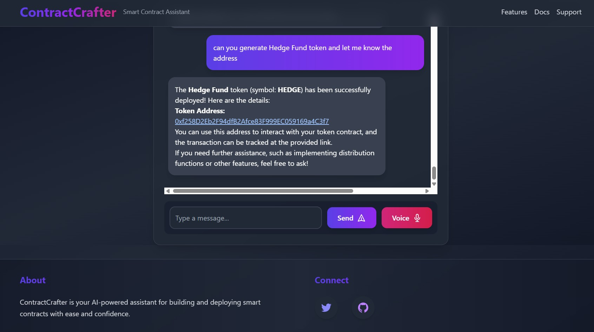
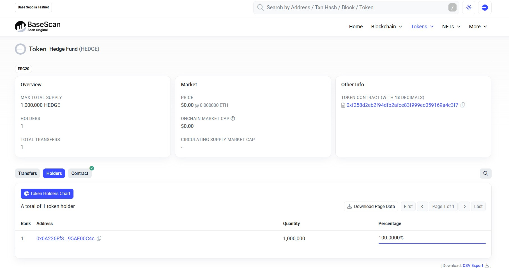

# Onchain Agent Powered by AgentKit

This is a [Next.js](https://nextjs.org) project bootstrapped with `create-onchain-agent`.  

It integrates [AgentKit](https://github.com/coinbase/agentkit) to provide AI-driven interactions with on-chain capabilities.

## Getting Started

First, install dependencies:

```sh
npm install
```

Then, configure your environment variables:

```sh
mv .env.local .env
```

Run the development server:

```sh
npm run dev
```

Open [http://localhost:3000](http://localhost:3000) in your browser to see the project.


## Configuring Your Agent

You can [modify your configuration](https://github.com/coinbase/agentkit/tree/main/typescript/agentkit#usage) of the agent. By default, your agentkit configuration occurs in the `/api/agent/prepare-agentkit.ts` file, and agent instantiation occurs in the `/api/agent/create-agent.ts` file.

### 1. Select Your LLM  
Modify the OpenAI model instantiation to use the model of your choice.

### 2. Select Your Wallet Provider  
AgentKit requires a **Wallet Provider** to interact with blockchain networks.

### 3. Select Your Action Providers  
Action Providers define what your agent can do. You can use built-in providers or create your own.

---

## Create a Smart Contract Agent


## Create an Automated Trading Agent


## Marketting Agent with ERC20 tokens


## Hedge Fund - ERC20 tokens with 1 million supply


## Owner's address is having responsibility to distribute tokens


## Token Address



## Token Contract


## Token Holders



## Token Information


## Create a Smart Contract Agent with Voice 

<html>
    <body>
        <video controls><source src="images/voice-recording.mp4" type="video/mp4"/></video>
    </body>
</html>

---

## Next Steps

- Explore the AgentKit README: [AgentKit Documentation](https://github.com/coinbase/agentkit)
- Learn more about available Wallet Providers & Action Providers.
- Experiment with custom Action Providers for your specific use case.

---

## Learn More

- [Learn more about CDP](https://docs.cdp.coinbase.com/)
- [Learn more about AgentKit](https://docs.cdp.coinbase.com/agentkit/docs/welcome)
- [Learn more about Next.js](https://nextjs.org/docs)
- [Learn more about Tailwind CSS](https://tailwindcss.com/docs)

---

## Contributing

Interested in contributing to AgentKit? Follow the contribution guide:

- [Contribution Guide](https://github.com/coinbase/agentkit/blob/main/CONTRIBUTING.md)
- Join the discussion on [Discord](https://discord.gg/CDP)
